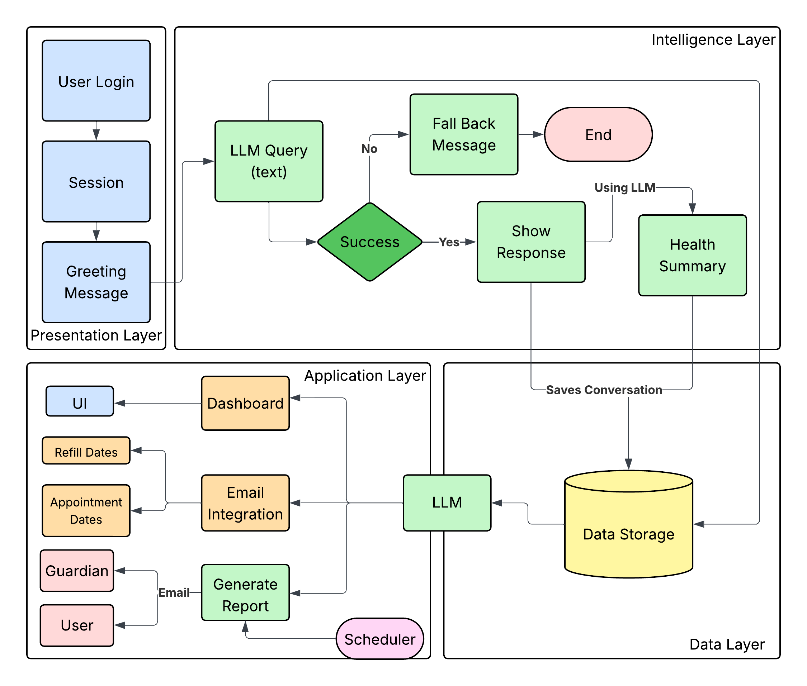
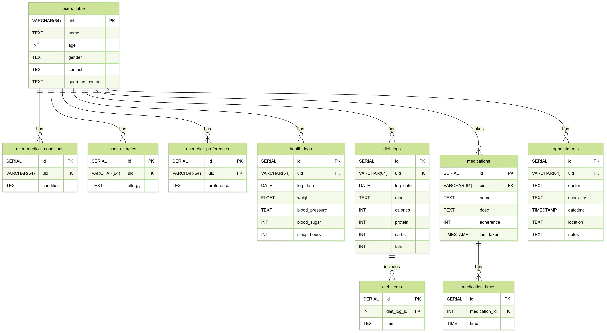

[![Contributors][contributors-shield]][contributors-url]
[![Forks][forks-shield]][forks-url]
[![Stargazers][stars-shield]][stars-url]
[![Issues][issues-shield]][issues-url]

 

  

  

    Wellness made simple, with a friend by your side
  

## About The Project

This project is an AI assistant designed to help users manage their health and fitness. It provides a comprehensive solution for tracking daily diets and following personalized health guidelines, whether for specific diet plans or medical conditions. The assistant uses a combination of advanced AI and user-friendly features like voice chat, WhatsApp notifications, and interactive dashboards to make managing your well-being simple and accessible. It's built to help a wide range of people, from fitness enthusiasts and athletes to the elderly and those recovering from illness, giving them the tools they need to achieve their health goals.

(<a href="#readme-top">back to top</a>)

## Built With

* 
* 
* 

(<a href="#readme-top">back to top</a>)

## Flow Chart

  

## ER Diagram

  

## 🗂 Agents Overview

### ChatBot
| Agent Name        | Purpose                     | Capabilities                                |
|-------------------|-----------------------------|---------------------------------------------|
| *base* | Health summarization        | Summarize logs, detect risks, generate reports |
| *health_log* | Daily vitals logging        | Input BP, weight, sugar, sleep; store records |
| *medication_log*| Manage medications          | Add, remove, update meds; keep history        |
| *report* | Health report generator     | Compile summaries, format, send via email     |
| *appointment_dates* | Appointment management | Summarize visits, doctor/specialty insights   |
| *refill_dates* | Medication refills          | Track schedules, give reminders               |
| *logging diet* | Diet & nutrition logging    | Parse meals, store logs, estimate nutrition   |
| *qna* | Query answering             | Handle queries, show trends, summarize conditions |
| *scheduler* | Automations                 | Schedule reminders and periodic tasks         |
| *conversation-save* | Save interactions       | Store and retrieve past conversations         |

---

### Dashboard 
| Agent Name              | Purpose                      | Capabilities                                                                  |
| ----------------------- | ---------------------------- | ----------------------------------------------------------------------------- |
| *BloodSugarAgent* | Blood sugar monitoring       | Fetch daily blood sugar data and generate trend graphs                        |
| *bloodPressure* | Blood pressure monitoring    | Fetch daily blood pressure data and generate trend graphs                     |
| *Daily Sleep* | Sleep tracking               | Fetch and visualize daily sleep hours consumption                             |
| *Daily Calories* | Calorie intake tracking      | Fetch daily calories consumption data                                         |
| *Daily Carbs* | Carbohydrate intake tracking | Fetch daily carbs consumption data                                            |
| *Daily Protein* | Protein intake tracking      | Fetch daily protein consumption data                                          |
| *Daily Fats* | Fat intake tracking          | Fetch daily fats consumption data                                             |
| *PiChartAgent* | Nutrition visualization      | Show daily nutrition breakdown using pie chart (cal, protein, carbs, fats)    |
| *Fetch Patients Data* | Patient data integration     | Retrieve patient’s medical condition, allergies, weight, height from database |

---

## Dashboard Preview

  

## Contributors

(<a href="#readme-top">back to top</a>)

[contributors-shield]: https://img.shields.io/github/contributors/MayankPadhi-0709/FitPal.svg?style=for-the-badge
[contributors-url]: https://github.com/MayankPadhi-0709/FitPal/graphs/contributors
[forks-shield]: https://img.shields.io/github/forks/MayankPadhi-0709/FitPal.svg?style=for-the-badge&logo=github
[forks-url]: https://github.com/MayankPadhi-0709/FitPal/network/members
[stars-shield]: https://img.shields.io/github/stars/MayankPadhi-0709/FitPal.svg?style=for-the-badge&logo=github
[stars-url]: https://github.com/MayankPadhi-0709/FitPal/stargazers
[issues-shield]: https://img.shields.io/github/issues/MayankPadhi-0709/FitPal.svg?style=for-the-badge
[issues-url]: https://github.com/MayankPadhi-0709/FitPal/issues
[license-shield]: https://img.shields.io/github/license/MayankPadhi-0709/FitPal.svg?style=for-the-badge
[license-url]: https://github.com/MayankPadhi-0709/FitPal/blob/main/LICENSE
[linkedin-shield]: https://img.shields.io/badge/-LinkedIn-0A66C2?style=for-the-badge&logo=linkedin&logoColor=white
[linkedin-url]: https://linkedin.com/in/your-profile-url
