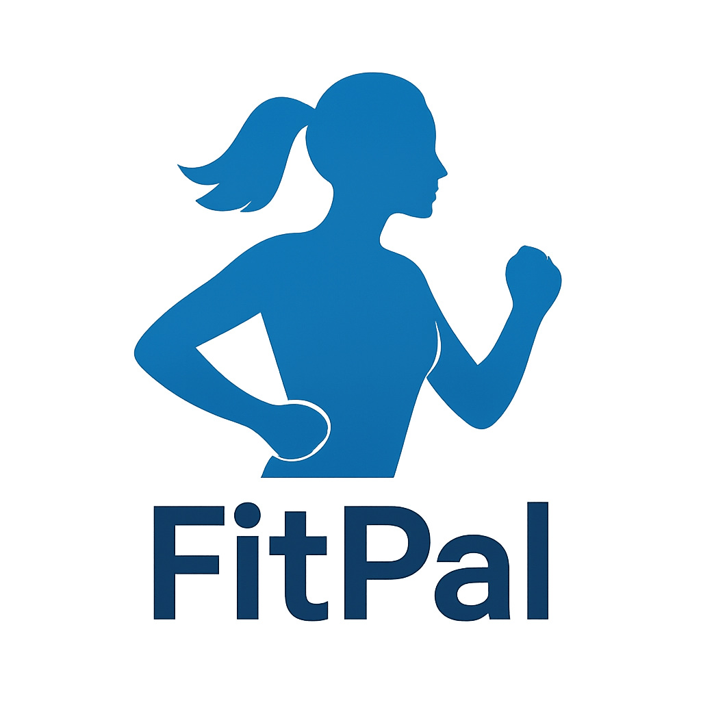
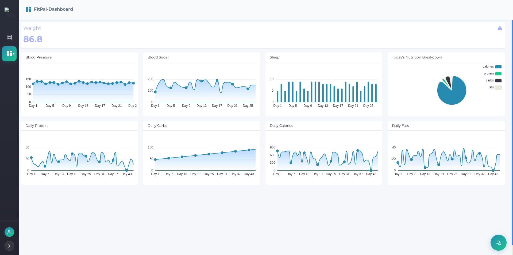

<!-- PROJECT LOGO -->
 

  

  

    Wellness made simple, with a friend by your side
  

<!-- TABLE OF CONTENTS -->

  
Table of Contents

  <ol>
    <li>
      <a href="#about-the-project">About The Project</a>
      <ul>
        <li><a href="#built-with">Built With</a></li>
      </ul>
    </li>
    <li>
      <a href="#getting-started">Getting Started</a>
      <ul>
        <li><a href="#prerequisites">Prerequisites</a></li>
        <li><a href="#installation">Installation</a></li>
      </ul>
    </li>
    <li><a href="#usage">Usage</a></li>
    <li><a href="#roadmap">Roadmap</a></li>
    <li><a href="#contributing">Contributing</a></li>
    <li><a href="#license">License</a></li>
    <li><a href="#contact">Contact</a></li>
    <li><a href="#acknowledgments">Acknowledgments</a></li>
  </ol>

<!-- ABOUT THE PROJECT -->
## About The Project

This project is an AI assistant designed to help users manage their health and fitness. It provides a comprehensive solution for tracking daily diets and following personalized health guidelines, whether for specific diet plans or medical conditions. The assistant uses a combination of advanced AI and user-friendly features like voice chat, WhatsApp notifications, and interactive dashboards to make managing your well-being simple and accessible. It's built to help a wide range of people, from fitness enthusiasts and athletes to the elderly and those recovering from illness, giving them the tools they need to achieve their health goals.

(<a href="#readme-top">back to top</a>)

<!-- Build With -->
### Built With

* [![qRaptor.ai][QRaptor.ai]][QRaptor-url]
* [![PostgreSQL][PostgreSQL.com]][PostgreSQL-url]
* [![Python][Python.org]][Python-url]

(<a href="#readme-top">back to top</a>)

[QRaptor.ai]: https://img.shields.io/badge/qRaptor.ai-000000?style=for-the-badge&logo=appveyor&logoColor=white
[QRaptor-url]: https://qraptor.ai
[PostgreSQL.com]: https://img.shields.io/badge/PostgreSQL-316192?style=for-the-badge&logo=postgresql&logoColor=white
[PostgreSQL-url]: https://www.postgresql.org
[Python.org]: https://img.shields.io/badge/Python-FFD43B?style=for-the-badge&logo=python&logoColor=blue
[Python-url]: https://www.python.org

## 🗂 Agents Overview

## ChatBot
 
| Agent Name        | Purpose                     | Capabilities                                |
|-------------------|-----------------------------|---------------------------------------------|
| *base*          | Health summarization        | Summarize logs, detect risks, generate reports |
| *health_log*    | Daily vitals logging        | Input BP, weight, sugar, sleep; store records |
| *medication_log*| Manage medications          | Add, remove, update meds; keep history        |
| *report*        | Health report generator     | Compile summaries, format, send via email     |
| *appointment_dates* | Appointment management | Summarize visits, doctor/specialty insights   |
| *refill_dates*  | Medication refills          | Track schedules, give reminders               |
| *logging diet*  | Diet & nutrition logging    | Parse meals, store logs, estimate nutrition   |
| *qna*           | Query answering             | Handle queries, show trends, summarize conditions |
| *scheduler*     | Automations                 | Schedule reminders and periodic tasks         |
| *conversation-save* | Save interactions       | Store and retrieve past conversations         |
 
<!--  -->

## Dashboard 
 
| Agent Name              | Purpose                      | Capabilities                                                                  |
| ----------------------- | ---------------------------- | ----------------------------------------------------------------------------- |
| *BloodSugarAgent*     | Blood sugar monitoring       | Fetch daily blood sugar data and generate trend graphs                        |
| *bloodPressure*       | Blood pressure monitoring    | Fetch daily blood pressure data and generate trend graphs                     |
| *Daily Sleep*         | Sleep tracking               | Fetch and visualize daily sleep hours consumption                             |
| *Daily Calories*      | Calorie intake tracking      | Fetch daily calories consumption data                                         |
| *Daily Carbs*         | Carbohydrate intake tracking | Fetch daily carbs consumption data                                            |
| *Daily Protein*       | Protein intake tracking      | Fetch daily protein consumption data                                          |
| *Daily Fats*          | Fat intake tracking          | Fetch daily fats consumption data                                             |
| *PiChartAgent*        | Nutrition visualization      | Show daily nutrition breakdown using pie chart (cal, protein, carbs, fats)    |
| *Fetch Patients Data* | Patient data integration     | Retrieve patient’s medical condition, allergies, weight, height from database |
 

